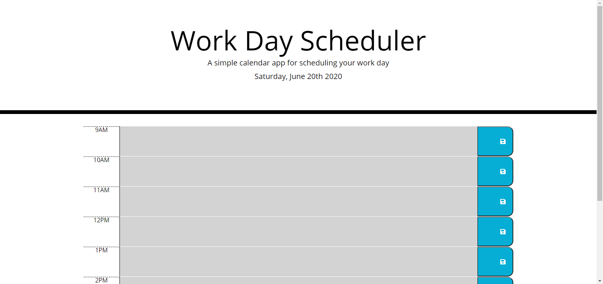

# Work Day Scheduler

## Purpose
This is a web page to help the user organize their schedule, with built in save buttons that save input information locally, today's date, and the current hour of the day displayed by text box color.
## Built with
* HTML
* CSS
* JavaScript
* Web APIs
## Website
https://scotitakura.github.io/Work-Day-Scheduler/
## Contributions
* Scot Itakura